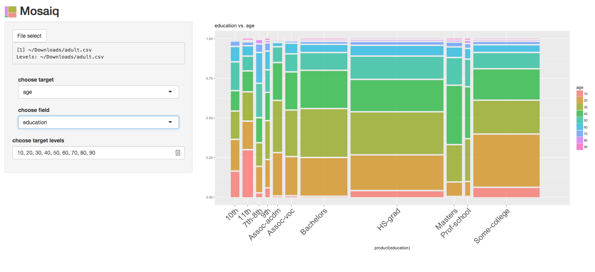

THIS IS THE LEGACY REPO, PLEASE SEE THE NEW PYTHON REPO AT : https://github.com/jdonaldson/mosaiq

# Mosaiq

Intelligent mosaic-based visualization for analysis of binned/categorical data.

## Instructions

1. Clone this repo
2. Install [R](https://cran.r-project.org/) (and maybe [libpcre](http://www.pcre.org/))
3. Run R inside the project directory (which should install required R
   packages).
4. execute the ``launch`` command in this repo
